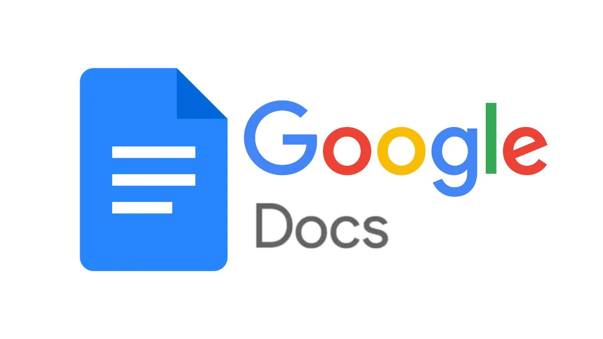

# Google Docs

## Table of Contents

- [Introduction](#introduction)
- [Features](#features)
- [Build Process](#build-process)
- [Tech Stack](#tech-stack)

 

## Introduction

Google Docs is an online word processor included as part of the free, web-based Google Docs Editors suite offered by Google

This is a clone of the original google docs site which was made only for educational purposes using react as the frontend and the firebase as the backend.

## Features

🚀 Manage Documents  
🚀 Read/Write Documents  
🚀 Authentication using google

## Build Process

- Clone or download the repo
- `npm install` or `yarn` to install dependencies
- `npm start` or `yarn run dev` to run the application

## Tech Stack

    
    
    
    

